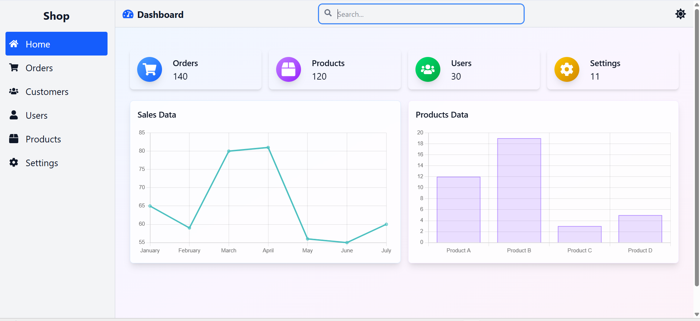

# 📊 React Dashboard

A modern and responsive **Dashboard UI** built with **React, Vite, Tailwind CSS, and Chart.js**.  
It includes a sidebar, navbar, cards, and charts with light/dark theme support.  

---

## 🚀 Features
- ⚡ Built with **React + Vite** for fast performance
- 🎨 Styled with **Tailwind CSS**
- 🌙 **Light/Dark mode** toggle
- 📊 **Charts** using Chart.js (Line + Bar)
- 📱 Fully **responsive design**
- ✨ Animated cards with hover effects

---

## 📂 Project Structure
src/
├── App.jsx # Main App component
├── main.jsx # React entry point
├── assets/ChartData.jsx # Chart.js sample data
├── components/
│ ├── Dashboard.jsx # Dashboard page
│ ├── Card.jsx # Reusable stat card
│ ├── Navbar.jsx # Top navigation bar
│ ├── Sidebar.jsx # Sidebar navigation
├── context/
│ └── ThemeContextProvider.jsx # Dark/Light mode context

---

## 🛠️ Installation & Setup

1. Clone the repo:
   ```bash
   git clone https://github.com/Durgarao3/React-Dashboard.git
   cd React-Dashboard
   ```
2. Install dependencies:
   ```bash
   npm install
  ```
3. Start development server:
  ```bash
  npm run dev
  ```
4. Build for production:
  ```bash
  npm run build
  ```
## 📸 Screenshots


## 🤝 Contributing

Pull requests are welcome. For major changes, please open an issue first to discuss what you’d like to change.

---

### ✅ Steps for You:
1. Create a folder in your project root:
   Screenshot
2. Save your image as:
   screenshots/dashboard.png
3. Replace your current `README.md` with the above content.  
4. Commit and push:
```bash
git add README.md screenshots/dashboard.png
git commit -m "Added final README with screenshot"
git push origin main
```
